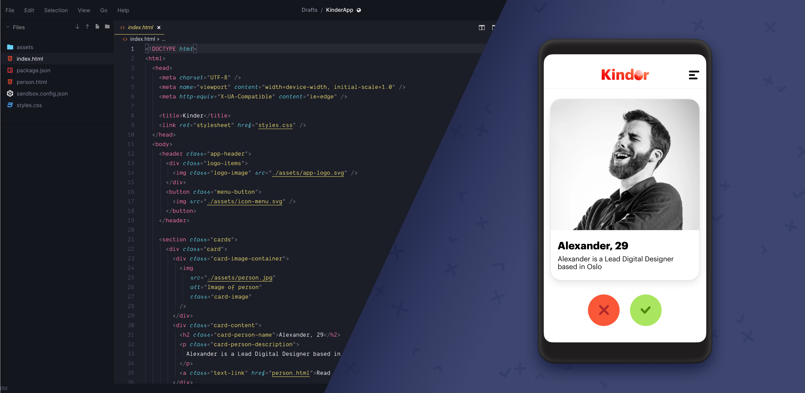

<!-- ---
marp: true
headingDivider: 2
--- -->



# 01 HTML and CSS - Basics

This is what we will make today: an app for finding and matching with people at EGGS.

## Resources

- [Figma file](https://www.figma.com/file/zqZmMHuzI4aLm7y4NMMi1V/Kinder-app?node-id=0%3A1) design specification (also has the icons you will need)
- A [proposal](https://codesandbox.io/s/kinderapp-jog8u?file=/index.html) for how to code this, if you get stuck

## HTML has a lot of baggage

Before we start, know this: HTML (and later, CSS) was first created as a document formatting language, like Word. It is also quite old. If you keep this in mind while working with HTML documents, maybe you will forgive some of the strange parts.

## HTML tags and attributes

An HTML element (usually) has an opening tag and a closing tag. Note that the closing tag starts with `</`.

```html
<section>...content goes here</section>
```

You can put elements inside other elements

```html
<section>
  <h1>Kinder</h1>

  <h2>Alexander, 29</h2>
  <p>I like long walks on the beach and late nights by the fireplace</p>

  <button>❌</button>
  <button>✅</button>
</section>
```

## Basic HTML structure

Most HTML pages follow this basic structure

```html
<!DOCTYPE html>
<html>
  <head>
    ...meta data
  </head>
  <body>
    ...content you can actually see
  </body>
</html>
```

## Adding stylesheets (CSS)

The standard way of styling html documents is to add a separate style document that describes what our html elements should look like.

Create a stylesheet called `style.css` in the same directory as your html file, and add the following code inside the `<head>` element in your html file.

```html
<head>
  <link rel="stylesheet" href="./style.css" />
</head>
```

As an example, lets give our `<button>` elements some styles.

```css
button {
  padding: 4px;
  border-radius: 8px;
}
```

## Targeting styles with classes

However, that css rule will make EVERY `<button>` element in our document get the same style. What if we want one of the buttons to stand out?

Let's add a specific identifier to one of our buttons, with a `class` attribute.

```html
<button>Cancel</button>
<button>Read more</button>
<button class="accept-button">Accept</button>
```

```css
/* All button elements */
button {
  padding: 4px;
  border-radius: 8px;
}

/* Only elements with the class "accept-button" */
.accept-button {
  background-color: green;
}
```

## Margins and Paddings

- **Margins** add spacing around your element
- **Padding** adds spacing inside your element

## Display properties

The display type of an element dictates how it will look on the page. By default, most elements are either of type `inline` or of type `block`.

- `block` elements (like `div`, `p`, `h1`-`h6`, `section`) want to take the full width of the page, and behave like a big block.
- `inline` elements (like `span`, `a`, `strong`) follow the text flow of the content.
- `grid` will render its contents in a grid (when supplemented with a few extra css rules)
- `flex` behaves similar to `block`, but with better layout functionality. You will probably use this a lot, and [CSS Tricks has a great article on how to use Flexbox](https://css-tricks.com/snippets/css/a-guide-to-flexbox/).

---

## Homework

The following interactive tasks are hosted on Free Code Camp, which has tons of resouces for hands-on learning web technology and coding. Open the **Responsive Web Design Certification** category to find the following tracks. It may look like a lot of exercises, but they are super quick to finish when you get the hang of it.

- Finish the first 10 exercises in the [HTML track at Free Code Camp](https://www.freecodecamp.org/learn)
- Finish the first 10 exercises in the [CSS track at Free Code Camp](https://www.freecodecamp.org/learn)

## Extra resources

- [Free Code Camp](https://www.freecodecamp.org/) (interactive web tutorials - highly recommended)
- Mozilla Developers Network (your go-to encyclopedia of web stuff)
  - MDN page for [HTML](https://developer.mozilla.org/en-US/docs/Web/HTML)
  - MDN page for [CSS](https://developer.mozilla.org/en-US/docs/Web/CSS)
- [Fireship on YouTube](https://www.youtube.com/c/AngularFirebase/featured) (really good video tutorials, both easy and advanced topics)
