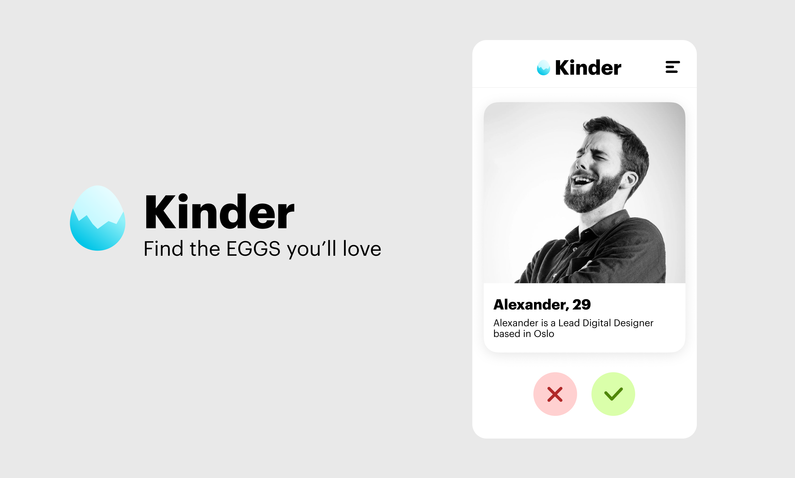

# 01 - Structure and Style with HTML and CSS

This is what we will make today: an app for finding and matching with people at EGGS. I've made a [proposal](https://codesandbox.io/s/kinderapp-jog8u?file=/index.html) for how to code this, which you can check out if you get stuck along the way.



Before we start, know this: HTML (and later, CSS) was first created as a document formatting language, like Word. It is also quite old. If you keep this in mind while working with HTML documents, maybe you will forgive some of the strange parts.

## HTML tags and attributes
An HTML element (usually) has an opening tag and a closing tag. Note that the closing tag starts with `</`.

```html
<section>
...content goes here
</section>
```

You can put elements inside other elements

```html
<section>
	<h1>Kinder</h1>

	<h2>Alexander, 29</h2>
	<p>I like long walks on the beach and late nights by the fireplace</p>
</section>
```

## Basic HTML structure
Most HTML pages follow this basic structure

```html
<!DOCTYPE html>
<html>
	<head>
		...meta data
	</head>
	<body>
		...content you can actually see
	</body>
</html>
```

## Adding stylesheets (CSS)
The standard way of styling html documents is to add a separate style document that describes what our html elements should look like. 

Create a stylesheet called `style.css` in the same directory as your html file, and add the following code inside the `<head>` element in your html file.

```html
<head>
	<link rel="stylesheet" href="./style.css">
</head>
```

As an example, lets give our `<button>` elements some styles.

```css
button {
	padding: 4px;
	border-radius: 8px;
}
```


## Targeting styles with classes
However, that css rule will make EVERY `<button>` element in our document get the same style. What if we want one of the buttons to stand out?

Let's add a specific identifier to one of our buttons, with a `class` attribute.

```html
<button>Cancel</button>
<button>Read more</button>
<button class="accept-button">Accept</button>
```

```css
/* All button elements */
button {
	padding: 4px;
	border-radius: 8px;
}

/* Only buttons with the class "accept-button" */
button.accept-button {
	background-color: green;
}
```

## CSS with queries
In css, you can also code which styles should be applied based on input conditions like screen width or preferred color theme.

### Dark mode 😈
```css
/* Normal mode shows light background with black text */
html {
	background-color: white;
	color: black;
}

/* Dark mode has black background with white text */
@media (prefers-color-scheme: dark) {
	html {
		background-color: black;
		color: white;
	}
}
```

### Screen size
Using media queries, you can also change the styles based on how big the screen is. This is a nice way to adapt the layout when people are accessing your website via their phone.

```css
body {
	font-size: 1.2rem;
}

/* Makes the text a bit smaller when the screen is smaller */
@media screen and (max-width: 480px) {
	body {
		font-size: 0.8rem;
	}
}
```


---
## Task
Your mission, should you choose to accept it, is to develop the rest of the Kinder app.

---
## Homework and extra resources
* Mozilla Developers Network (your go-to encyclopedia of web stuff)
	* MDN page for [HTML](https://developer.mozilla.org/en-US/docs/Web/HTML)
	* MDN page for [CSS](https://developer.mozilla.org/en-US/docs/Web/CSS)
* [Fireship on YouTube](https://www.youtube.com/c/AngularFirebase/featured) (really good video tutorials, both easy and advanced topics)
